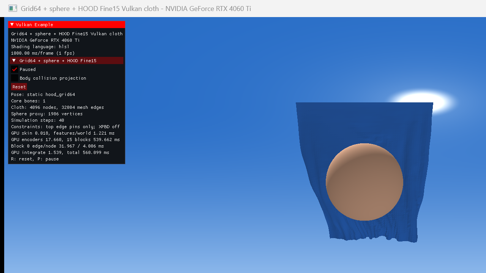

# Grid64 + sphere + HOOD Fine15（无 XPBD）

## 测试目的

验证官方 HOOD `fine15.pth` 在规则 `64×64` 布片和静态球体上，完全不依赖 XPBD 或碰撞投影时，能否连续自回归并保持网格结构；同时测量当前正确性优先 Vulkan 实现的逐阶段 GPU 时间。

## 场景

- 布片：`4096` 顶点、`7938` 三角形、无自环 8 邻域 CSR、`32004` 条有向 mesh edge。
- 约束：只硬固定完整顶边 `64` 点；XPBD 关闭。
- 障碍物：半径 `0.3 m` 的静态 UV 球，`1986` 个碰撞代理点；碰撞投影关闭。
- 布片尺寸：`1.2 m × 1.2 m`，密度 `0.2 kg/m²`。使用米制尺度以接近 Fine15 的训练特征范围。
- 网络：HOOD Fine15，20/12/9 维 node/mesh-edge/world-edge 输入，128 维 latent，15 个 GraphNet block，FP32。
- 设备：NVIDIA GeForce RTX 4060 Ti，驱动 `596.36.0.0`。

资产由确定性脚本生成：

```powershell
.\tools\bake_hood_grid_scene.ps1
```

交互运行与复现实测：

```powershell
.\run.ps1 -Scene HoodGrid64
.\benchmark_hood_static.ps1 -Scene HoodGrid64 -Warmup 5 -Samples 120
```

## 结构稳定性

benchmark 结束时已经连续完成 `129` 个自回归步（首步 `1/3 s`，随后 `1/30 s`），约覆盖 `4.6 s` 模拟时间：

| 指标 | 结果 |
| --- | ---: |
| NaN/Inf 顶点 | 0 |
| 固定点最大误差 | 0 m |
| 最大位移 | 0.344894 m |
| 边长比例 mean / P95 / max | 1.0083 / 1.0595 / 1.1389 |
| 拉伸超过 1.5× 的边 | 0% |
| 收缩到低于 0.5× 的边 | 0% |
| 三角面积比例 mean / median | 1.0150 / 1.0147 |
| 面积低于初始 0.1× 的三角形 | 0% |
| 翻面三角形 | 1.2346% |

因此这次测试中 Fine15 **没有把规则网格拉成条**，也没有依靠 XPBD 暗中恢复长度。网络学到的结构先验足以在这一静态、规则且尺度合理的场景中维持整体布片。它仍不是完整碰撞求解器：关闭投影后存在少量局部翻面，HOOD world edge 只能提供网络输入，不能保证严格无穿透。

## GPU 时间

120 个正式样本，时间戳包含阶段之间的必要 compute barrier，不包含 graphics/present：

| 阶段 | mean | P95 | max |
| --- | ---: | ---: | ---: |
| skin | 0.0146 ms | 0.0189 ms | 0.0232 ms |
| features + world edge | 1.0747 ms | 1.0977 ms | 1.3017 ms |
| encoders | 17.5996 ms | 17.8612 ms | 17.8852 ms |
| 15 个 processor block | 531.5743 ms | 538.5049 ms | 539.2763 ms |
| decoder + integrate | 1.5463 ms | 1.5419 ms | 1.9077 ms |
| **total** | **551.8095 ms** | **558.8170 ms** | **559.5769 ms** |

当前约为 `1.81` 个模拟步/秒；相对 30 Hz 的 `33.3 ms` 预算慢约 `16.6×`。processor 占总 GPU 时间约 `96.3%`，所以减少消息传递次数、latent 宽度以及融合 edge/node MLP 是下一阶段的直接方向。这个结果是当前“一图元素一个 128-lane workgroup”的透明参考实现成本，不代表优化后的 GNN 架构下限。

原始数据见 `hood_grid64_fine15_timing.csv`、`hood_grid64_fine15_stability.json` 和 `hood_grid64_fine15_validation_output.txt`。Validation 与 synchronization validation 没有报告错误。

## 画面

下图为第 40 个模拟步暂停后的结果。布片已经受重力下垂并绕球形成大形，顶边保持水平，底部仍是连续曲面而非长条。


