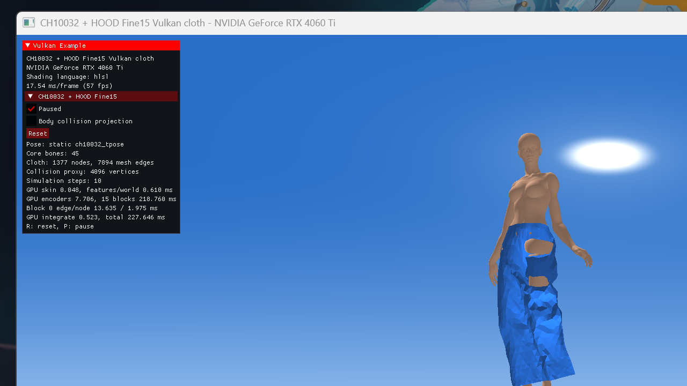
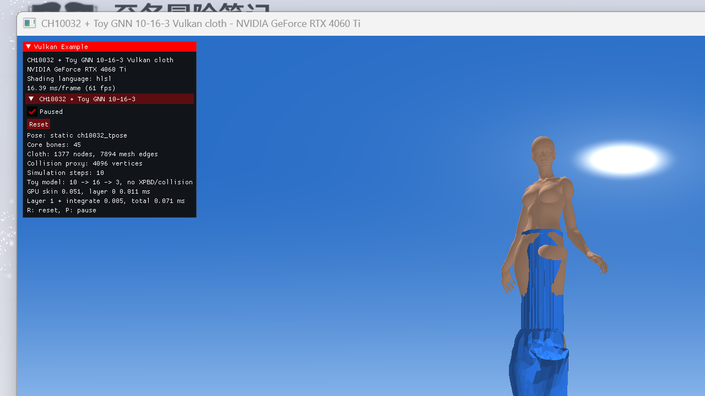

# CH10032 T-Pose: Fine15 vs. Toy2L

Both solvers use the same one-frame CH10032 T-Pose, 1,377 cloth vertices, 7,894 directed CSR edges and 72 fixed waist vertices. The optional Fine15 collision projection is disabled. Toy2L uses the original committed `VGNN v1` weights (`10→16→3`) without XPBD or body collision. Its vector inputs and outputs are transformed between the model's +Y-down training convention and the scene's Y-up convention.

## GPU timing

RTX 4060 Ti, FP32 HLSL/SPIR-V. Fine15 discarded 5 warmup samples and recorded 20 samples; Toy2L discarded 50 and recorded 200. Timestamps include required compute barriers but exclude graphics and present.

| Solver/stage | Mean (ms) | P95 (ms) |
|---|---:|---:|
| Fine15 skin | 0.056 | 0.060 |
| Fine15 features + encoders + 15 blocks + integration | 542.696 | — |
| **Fine15 total** | **542.752** | **601.109** |
| Toy2L skin | 0.036 | 0.058 |
| Toy2L layer 0 | 0.010 | 0.011 |
| Toy2L layer 1 + integration | 0.005 | 0.005 |
| **Toy2L total** | **0.055** | **0.078** |

Toy2L total compute is approximately **9,834× faster** in this direct implementation. Looking only at model work, Fine15's 15 processor blocks take 521.309 ms while both Toy2L layers take 0.0146 ms, a roughly 35,721× difference. Fine15 is intentionally still a correctness-oriented, one-workgroup-per-graph-element port rather than an optimized inference kernel.

Raw rows: [`hood_static_timing.csv`](hood_static_timing.csv) and [`hood_static_toy2l_timing.csv`](hood_static_toy2l_timing.csv). Both benchmark runs passed Khronos validation and synchronization validation.

## Equal-step visual comparison

Both screenshots are paused after exactly 10 simulation steps.

| Fine15 | Toy2L |
|---|---|
|  |  |

Fine15 retains substantially more skirt volume and coherent folds, although the single-level checkpoint still shows openings and body penetration on this unseen garment. Toy2L quickly loses circumferential and bending structure: much of the skirt collapses into long vertical strips while the waist pins remain attached.

This is consistent with the models' information content. Toy2L was trained on synthetic low-frequency deformation of a regular 16×16 eight-neighbour grid. It has 16 hidden channels, two graph passes and no body/world-edge features. The CH10032 garment is an irregular triangle graph and is far outside that training distribution. Fine15 has 128 hidden channels, 15 message-passing blocks and explicit cloth-to-body world edges, so it is much slower but qualitatively more suitable for the real mesh.

The useful next comparison is Toy2L plus the existing XPBD stretch/bend projection on the real `VCLTH v2` constraints. That would test whether the tiny network can provide motion while XPBD supplies the missing geometric structure.

## Conclusions and follow-up directions

The experiment supports three conclusions:

1. Increasing message-passing depth, hidden width and interaction features materially improves the model's ability to preserve a plausible garment shape on an unseen mesh. The result is not attributable to size alone: Fine15 also has a more relevant training distribution and explicit cloth-to-body world edges.
2. A GNN can generalize across garment topology to a useful degree, but a correctness-oriented direct port of a large network can be too expensive for a real-time cloth budget. The measured Fine15 time is not an architectural lower bound because the current Vulkan kernels intentionally prioritize transparent numerical validation over inference optimization.
3. The most practical use of learned cloth in the next phase is to complement, rather than replace, a constraint solver.

Two deployment paths are therefore recommended:

- **First-frame pose / warm start.** Predict a near-equilibrium garment pose from the character pose, rest garment, pins, gravity and body proximity. Run the network only on initialization, reset, teleport or garment changes, project its output through pins/collision and a few XPBD iterations, then hand the state to Chaos Cloth. Training labels can be produced from fully settled Chaos simulations. This directly targets initial penetration, sudden drop and long pre-roll issues without adding a per-frame neural cost.
- **Coarse GNN motion + XPBD detail.** Run a lightweight GNN at a lower rate to predict a low-frequency target shape or residual acceleration, and apply that result through a compliant target constraint. Let XPBD continue to handle stretch, bending, attachments, collision and self-collision at the simulation rate. The GNN should guide the large-scale silhouette and inertia instead of overwriting final vertex positions.

The immediate PoC sequence should be:

1. Add the real `VCLTH v2` stretch/bend constraints after Toy2L and measure whether XPBD restores structure while retaining the small network's cost.
2. Generate settled T-Pose and representative-pose labels with Chaos Cloth, then train a first-frame pose model through the shared training platform.
3. Compare cold-start Chaos, GNN warm start and continuous GNN+XPBD using initial penetration, time-to-stability, shape error and total GPU time.

A reasonable first lightweight target is 32–64 hidden channels and 3–6 message-passing blocks, potentially with shared block weights. FP16 and fused kernels should be evaluated only after the model/solver split has demonstrated useful visual quality.
