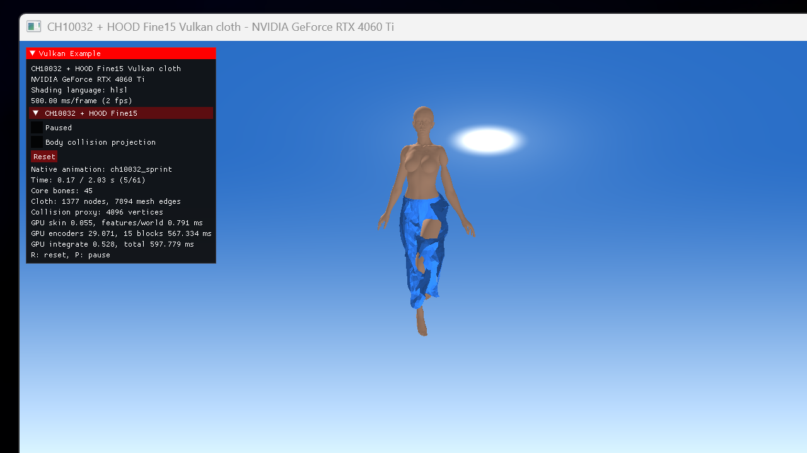

# CH10032 + HOOD Fine15 results

Test machine: NVIDIA GeForce RTX 4060 Ti, Vulkan SDK 1.4.309, FP32 HLSL/SPIR-V.

## Assets

- Native animation: `AS_C10032_ArmedSprint_Skirt`, 62 frames at 30 Hz (2.03 s), Root Motion retained.
- Runtime skeleton: 45 core/deformation bones; 665 secondary source bones collapsed to retained ancestors.
- Character: 67,857 render vertices and 128,988 triangles.
- Collision proxy: 4,096 lower-body vertices.
- Cloth: 1,377 vertices, 2,570 triangles, 7,894 directed mesh edges and 72 waist pins.
- Waist binding distance: 4.995 mm median, 9.582 mm maximum.
- All LBS weights sum to one within `4.48e-8`; all animation matrices and Root Motion samples are finite.

## Numerical verification

`verify_hood.ps1` compares the Vulkan result with the pure-PyTorch `VHOOD` rollout. The optional collision projection is disabled for this comparison.

| Check | Result | Limit |
|---|---:|---:|
| First-step position max error | 2.384e-7 m | 2e-4 m |
| First-step position mean error | 1.496e-8 m | 2e-5 m |
| First-step acceleration max error | 1.919e-7 | recorded |
| Ten-step position max error | 1.315e-4 m | 2e-3 m |
| Ten-step aggregate mean error | 1.929e-7 m | recorded |
| First-step world-edge mismatches | 0 / 1,377 | 0 |

Strict VCHAR/VANIM/VCLTH/VHOOD format tests, Python roundtrip/rejection tests, SPIR-V validation, Khronos validation and synchronization validation passed. Normal rendering performs no host readback; the debug buffers are read only under `--hood-verify`.

## GPU timing snapshot

The interactive sprint frame shown below reported approximately 0.06 ms skinning, 0.79 ms feature/world-edge construction, 29.1 ms encoders, 567.3 ms for 15 GraphNet blocks, 0.53 ms integration and 597.8 ms total. This direct 128-lane implementation is a correctness prototype, not an optimized inference runtime; the processor blocks are the clear bottleneck.

## Visual conclusion

Character scale, Y-up orientation, Root Motion camera following and waist attachment are working. The original single-level Fine15 output responds to the native sprint, but the unseen CH10032 skirt distribution and aggressive motion produce conspicuous stretch, folding and body penetration after only a few frames. The optional normal projection reduces local penetration but does not repair mesh stretch, and XPBD is intentionally not applied to the golden Fine15 result. This is therefore a successful deployment/numerical PoC, not production-quality cloth.

