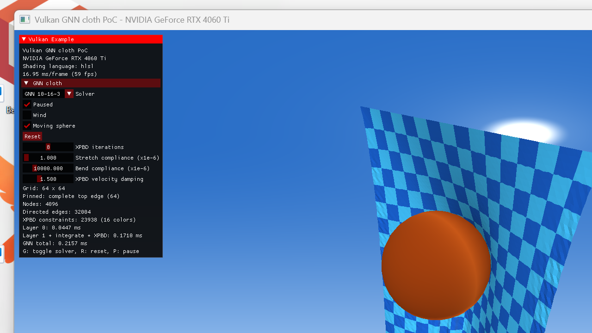

# RTX 4060 Ti validation results

Tested on 2026-08-17 with Vulkan SDK 1.4.309, an NVIDIA GeForce RTX 4060 Ti,
and NVIDIA driver 596.36. HLSL was compiled by the SDK's DXC to Vulkan 1.1
SPIR-V.

The single-step GPU result passed against the Python reference with maximum
absolute error `1.907348633e-06` and mean absolute error `3.117110078e-07`.
The 1200-frame health check reported no non-finite value or pinned-vertex drift.
A reset after 600 frames followed by the same 600 fixed-time-step frames was
bit-identical (`reset_replay_max_abs = 0`). Khronos validation plus
synchronization validation produced no error or warning. A hidden interactive
smoke run switched GNN → mass-spring → GNN and reset both paths without a
validation message. The interactive GNN path used eight colored Gauss-Seidel
XPBD iterations. Each undirected stretch, shear, and two-hop bend-distance
constraint owns an accumulated lambda and applies
`alpha_tilde = compliance / delta_time^2`; lambdas are cleared per time step and
retained across iterations. A 64×64 run still retained an extended hanging
sheet with sphere-contact folds after 15 seconds (about 900 VSync frames)
instead of collapsing into the bundle produced by the unconstrained rollout.
The finalize pass reconstructs velocity from the XPBD-corrected position,
applies exponential damping (1.5 by default), and treats sphere contact as a
zero-restitution normal-velocity projection so collision correction cannot
inject an artificial launch impulse.

The interactive sphere follows `x=1.2*sin(0.7*t)` and
`z=0.65+0.55*sin(1.1*t)`. Its analytic velocity is passed to both solver paths;
contact removes inward cloth velocity relative to the sphere, rather than
treating the moving collider as static. A validation-enabled smoke run exercised
moving contact for two seconds before switching and resetting both solvers with
no validation or synchronization message. The benchmark keeps the sphere still.

The final graphics path draws a procedural full-screen sky before scene
geometry, with a blue zenith, pale horizon, and soft sun. Brighter two-sided
cloth lighting and a lifted warm sphere material improve fold readability.
The sky adds no texture dependency and does not enter the compute timestamps.

| Grid | Nodes | Directed GNN edges | XPBD constraints | Layer 0 | Layer 1 + integrate | XPBD | Finalize | Total median | Total p95 |
| --- | ---: | ---: | ---: | ---: | ---: | ---: | ---: | ---: | ---: |
| 16×16 | 256 | 1,860 | 1,378 | 0.007456 ms | 0.003072 ms | 0.271904 ms | 0.002048 ms | 0.283904 ms | 0.286432 ms |
| 32×32 | 1,024 | 7,812 | 5,826 | 0.012512 ms | 0.004928 ms | 0.322560 ms | 0.001952 ms | 0.341536 ms | 0.344160 ms |
| 64×64 | 4,096 | 32,004 | 23,938 | 0.026272 ms | 0.011264 ms | 0.364192 ms | 0.002048 ms | 0.403936 ms | 0.408256 ms |

The earlier version of this table reported layer 1, integration, XPBD and finalize
as one span, which made the total look almost independent of graph size and
invited the wrong conclusion. Timing each stage separately shows what is actually
happening:

- **XPBD is 90% of the total at 64×64 and 96% at 16×16.** It grows only 1.34x
  across a 16x increase in vertices, because 8 iterations over 16 color batches
  means 128 dispatches and 256 barriers per frame whose cost is fixed rather
  than proportional to the cloth. `plans/gnn/gnn-cs.md` lists exactly this
  ("too many dispatches / barriers") among the top bottlenecks.
- **GNN inference is 9.3% of the total at 64×64** (0.0375 ms of 0.404 ms) and
  scales well: 3.6x for 16x the vertices.
- Finalize is flat at about 0.002 ms and is not worth optimizing.

So the headline cost is the constraint solver's dispatch structure, not the
network. Reducing the color count or moving to tile-local Gauss-Seidel inside a
workgroup is where the time is.

### Tile-local XPBD: attempted, measured, not adopted

`gnn_constraints_tiled.comp` collapses the iteration/color loops into one
dispatch per tile pass: a workgroup owns a horizontal band of rows, copies it to
groupshared memory, runs several Gauss-Seidel sweeps separated only by
`GroupMemoryBarrierWithGroupSync`, and alternates the band origin between passes
so band-crossing constraints move inside on the next pass. That takes the
dispatch count from 128 to 4. Select it with `--gnn-xpbd-mode tiled` or the
`XPBD dispatch` dropdown.

It is **not the default**, because it is only faster on the smallest grid:

| Grid | Colored dispatches | Colored XPBD | Tiled dispatches | Tiled XPBD | Result |
| --- | ---: | ---: | ---: | ---: | --- |
| 16×16 | 128 | 0.272608 ms | 4 | 0.204512 ms | 1.33x faster |
| 32×32 | 128 | 0.323040 ms | 4 | 0.332544 ms | 0.97x, a wash |
| 64×64 | 128 | 0.364320 ms | 4 | 0.638592 ms | 0.57x, clearly worse |

The premise still holds -- at 64×64 the colored path spends 0.0455 ms per
iteration, and 16 dispatch/barrier pairs at roughly 2.8 µs each account for
0.0448 ms of it, so it is very nearly all launch overhead. The tiled path fails
for two reasons that are implementation choices rather than properties of the
approach:

1. **Occupancy.** Row bands of 8 give `height/8` workgroups: 2, 4 and 8 for the
   three grids. Eight workgroups leave most of a 34-SM GPU idle, so each sweep
   costs 0.0399 ms -- nearly as much as a whole colored iteration.
2. **Redundant filtering.** Each thread walks all `6 x bandVertices` candidate
   constraints once per color and discards those of other colors, with an integer
   divide and modulo per candidate. That is 16x more index arithmetic than needed.

Fixing both means 2D tiles small enough to fill the GPU (8×8 gives 64 workgroups
at 64×64) plus exact per-(type, color) enumeration instead of filtering. That is
a larger change than this pass, so the measurement is recorded here rather than
guessed at.

Correctness of the tiled path was verified independently of its speed: bands
never overlap within a pass, so each vertex has one writer, and
`reset_replay_max_abs` stayed exactly 0 across a reset and replay, which is a
direct race check. Synchronization validation was clean. Quality was slightly
worse at these settings (max stretch strain 0.886 versus 0.813 for colored,
bend 0.481 versus 0.501), which is the second reason not to make it the default.

The timings are measurable and total time increases monotonically with graph
size. This is only a deployment-chain measurement: the synthetic one-step target
plus XPBD fallback is not evidence of production cloth quality. A benchmark run
that collects fewer than the requested 1000 samples is now a hard failure rather
than a CSV that looks normal apart from a smaller sample count, and timestamps
are skipped with an explicit message on devices whose compute queue reports no
valid timestamp bits.

## What the network actually contributes

`.\ablation.ps1` runs the same deterministic 600-step scenario four times,
changing only where the acceleration comes from, and compares final positions
(`results/gnn_ablation.json`). `analytic` evaluates the training target
directly, `gravity` is that formula with the neighbor coupling removed, and
`zero` supplies no acceleration at all.

| Comparison | Mean vertex distance | L2 |
| --- | ---: | ---: |
| `analytic` vs `gravity` (all of graph message passing) | 0.0035 | 0.1436 |
| `gnn` vs `analytic` (the network's own error) | 0.0451 | 2.1158 |
| `gnn` vs `zero` (any acceleration at all, gravity included) | 0.2363 | 8.0621 |

Two conclusions, both worth stating plainly:

- The acceleration term matters a great deal, but almost entirely through
  gravity. Removing the whole neighbor coupling moves the cloth by 3.5 mm mean
  over 600 steps, because the near-rigid XPBD distance constraints already
  enforce what the Laplacian term was approximating.
- The network's own approximation error is **14.7x larger than the effect the
  coupling produces**. So on this scenario the graph does not earn its cost, and
  the network is a more expensive, less accurate way to evaluate a formula that
  is three lines long.

This does not invalidate the PoC; it bounds its claim. What is demonstrated is
the deployment chain -- fixed weights, pure compute-shader inference, no host
readback, direct vertex-buffer draw -- and that chain is reproducible and
numerically verified. Learned dynamics are not demonstrated, and would need a
reference simulator for supervision plus a scenario where the coupling is not
already subsumed by the constraint solver.

The 1200-frame verification also reports physical health, not just finiteness:
cloth AABB extent, maximum stretch and bend strain, and how many vertices hit
the hard acceleration and speed clamps. In the golden scenario 402 of 1024
vertices hit the acceleration clamp and maximum stretch strain reaches 0.81.
That scenario hangs a 32-wide sheet from only two corners, where eight
Gauss-Seidel iterations cannot propagate tension across the sheet; the clamp
count also shows the network running well outside the 16x16 two-corner
distribution it was trained on. Both numbers were previously invisible.

