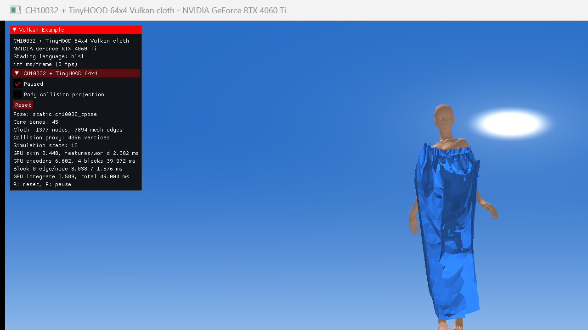

# TinyHOOD 64×4 测试结果

## 目的与架构

本测试把 HOOD Fine15 缩小为一个仍保持原输入契约的学生模型：

- node / mesh edge / world edge 输入仍为 `20 / 12 / 9` 维；
- 保留 NodeType embedding、Fine15 normalizer 和 cloth-to-body world edge；
- latent 从 `128` 降到 `64`；
- GraphNet processor 从 `15` 个 block 降到 `4` 个；
- decoder 仍输出 3 维加速度，积分、固定点和可选碰撞投影与 Fine15 相同；
- FP32，默认不使用 XPBD，也不启用碰撞投影。

模型不是截断 Fine15。`tools/train_tinyhood.py` 用已有 Fine15 rollout 做确定性蒸馏，重新训练全部 encoder、processor 和 decoder。前 48 个 sprint 状态训练，后 13 个状态做时间留出验证，训练 20 epoch，seed 为 `20260818`。

```powershell
.\.venv\Scripts\python.exe .\tools\train_tinyhood.py --epochs 20 --train-steps 48 --static-steps 120 --dagger-rounds 0
.\.venv\Scripts\python.exe .\tools\run_tinyhood_reference.py `
  --asset-root .\.work\real_scene\ch10032_tpose --motion ch10032_tpose --steps 10 `
  --golden .\.work\real_scene\ch10032_tpose\tinyhood64x4_rollout.vhgold
.\build.ps1
.\verify_hood.ps1 -Motion ch10032_tpose -Solver TinyHood
```

生成的权重位于被忽略的 `.work/hood_data/tinyhood64x4.vhood`，可由训练脚本完整重现。

## 模型大小

| 模型 | latent | blocks | FP32 参数/打包数 | VHOOD 大小 |
| --- | ---: | ---: | ---: | ---: |
| Fine15 | 128 | 15 | 3,854,164 | 15,501,924 B |
| TinyHOOD | 64 | 4 | 286,275 | 1,174,884 B |

TinyHOOD 参数量为 Fine15 的 `7.43%`，约缩小 `13.46×`；VHOOD 文件约缩小 `13.20×`。

## Python 蒸馏结果

teacher-forced 状态上的加速度拟合看起来尚可：

| 数据 | normalized MSE | acceleration mean abs | acceleration max abs |
| --- | ---: | ---: | ---: |
| 训练 48 帧 | 0.02740 | 0.001526 | 0.14442 |
| 留出 13 帧 | 0.06061 | 0.001769 | 0.07743 |

但纯 student 闭环 rollout 失败：

| 场景 | 步数 | edge ratio P95 | >1.5× 边 | 翻面三角形 | 结论 |
| --- | ---: | ---: | ---: | ---: | --- |
| CH10032 sprint | 61 | 22.77 | 83.81% | 44.55% | 发散 |
| CH10032 T-Pose | 120 | 55.37 | 93.51% | 45.56% | 发散 |
| Grid64 + sphere | 120 | 7.34 | 70.24% | 38.80% | 发散 |

这说明低 teacher-forced 误差不能替代闭环稳定性。HOOD 使用二阶位置积分，持续存在的很小加速度偏差会累积成速度和位置漂移；学生进入训练分布以外后，误差继续放大。

还测试了三轮 on-policy/DAgger 蒸馏，每轮分别使用 25%、50%、75% student 状态，并从 sprint、T-Pose、Grid64 各采集 30 个 Fine15 标签。第一轮留出 MSE 短暂降到 `0.05314`，但更高 student 占比使状态快速远离正常布料，最终闭环更差。该失败消融保存在 `tinyhood64x4_dagger_experiment.json`，没有作为运行权重。

## Vulkan 数值正确性

为 64 latent 单独实现了 64-lane HLSL encoder、edge update、node update 和 decoder/integrate，并继续使用原有特征、world edge、barrier 和 device-local buffer 路径。

相对 Python TinyHOOD：

| 指标 | 结果 |
| --- | ---: |
| 第一步位置 max abs | 1.19e-7 |
| 第一步加速度 max abs | 1.13e-7 |
| 10 步位置 max abs | 9.54e-7 |
| 10 步位置 mean abs | 3.08e-8 |
| 第一步 world edge mismatch | 0 |

因此后续视觉发散来自模型/训练，而不是 Vulkan 转换错误。Khronos Validation 与 synchronization validation 没有报告错误。

## RTX 4060 Ti GPU 时间

时间戳包含阶段间 compute barrier，不包含 graphics/present。

| 场景/模型 | features | encoders | processor | decoder + integrate | total |
| --- | ---: | ---: | ---: | ---: | ---: |
| CH10032 Fine15 | — | — | 521.31 ms | — | 542.75 ms |
| CH10032 TinyHOOD，首个正式样本 | 0.607 ms | 1.795 ms | 13.202 ms | 0.161 ms | **15.792 ms** |
| CH10032 TinyHOOD，50 样本均值 | 0.480 ms | 1.723 ms | 10.059 ms | 0.153 ms | **12.438 ms** |
| Grid64 Fine15 | 1.075 ms | 17.600 ms | 531.574 ms | 1.546 ms | 551.809 ms |
| Grid64 TinyHOOD，50 样本均值 | 0.791 ms | 4.804 ms | 36.938 ms | 0.441 ms | **42.986 ms** |

CH10032 初始状态相对 Fine15 提速约 `34.4×`，连续样本均值约 `43.6×`。连续均值更低的一部分原因是发散后 world edge 数量下降，因此评估实时预算时应优先看初始 `15.79 ms`。它刚好进入 60 Hz 的 `16.67 ms` compute 预算，但尚未包含绘制和 present。

Grid64 有 32,004 条 mesh edge，TinyHOOD 仍需 `42.99 ms`，相对 Fine15 提速 `12.8×`，但还达不到 30 Hz。

## Vulkan 闭环结构

无 XPBD、无碰撞投影：

| 场景 | 完成步数 | edge ratio P95 | >1.5× 边 | 固定点误差 | 最大位移 | 结构保持 |
| --- | ---: | ---: | ---: | ---: | ---: | --- |
| CH10032 T-Pose | 59 | 26.16 | 80.39% | 0 | 4.59 m | 否 |
| Grid64 + sphere | 59 | 2.98 | 18.80% | 0 | 4.21 m | 否 |

CH10032 在第 5 步时 edge ratio P95 已达到 `6.49`，因此不是只在长时间后缓慢漂移。第 10 步画面已经出现明显膨胀、折叠和条带化：



## 结论与下一步

这次测试证明 `20/12/9 + latent64 + 4 blocks` 的 Vulkan 成本对 CH10032 已有吸引力，但当前小数据蒸馏权重不能独立完成连续布料模拟。不能据此断言 64×4 架构上限不足，因为本轮只有一段 61 帧 teacher rollout，缺少多动作、多服装、状态扰动和真正的多步 rollout loss。

推荐下一步：

1. 用 CH10032 多动画、Grid64、Chaos/XPBD 数据扩充状态覆盖，训练目标至少展开 8–16 步，而不只拟合单步加速度。
2. 训练时对速度、位置和法线加入受控扰动，并由 Fine15/Chaos 重新标注恢复轨迹；不要继续学习已经爆炸的 student 状态。
3. 保留当前 TinyHOOD Vulkan 部署路径，把它作为 15–30 Hz 大形预测，然后接 XPBD/Chaos 恢复长度、弯曲、碰撞和自碰撞。这比要求当前学生独立维持所有高频约束更符合已有测试结论。
4. 若多步训练后 64×4 仍不够，再依次测试 `64×6` 与 `96×4`，而不是直接回到 128×15。

原始结果：

- `tinyhood64x4_python.json`
- `tinyhood64x4_dagger_experiment.json`
- `tinyhood_verify.json`
- `tinyhood_ch10032_tpose_initial_timing.csv`
- `tinyhood_ch10032_tpose_timing.csv`
- `tinyhood_grid64_timing.csv`
