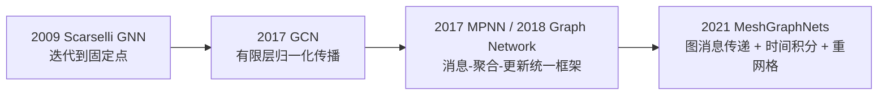

# 图神经网络（GNN）：从图上的局部传播到布料物理推理

> 本文是一份面向学习与工程实践的中文总览。主线来自本目录中的三篇原始论文：Scarselli 等人的固定点 GNN、Kipf 与 Welling 的 GCN、Pfaff 等人的 MeshGraphNets；再用 Distill、MPNN 与 Graph Network 等公开一手资料补齐现代统一视角。本文不是逐字翻译，公式符号也做了统一。

## 0. 先记住这张地图

GNN 最核心的思想可以压缩成一句话：

> 把对象放在节点上，把对象之间允许发生的相互作用放在边上；沿边重复执行同一个可学习的局部规则，再按任务读出节点、边或整张图的结果。

它背后的推理链是：

1. 图没有固定大小，也没有天然的节点顺序，普通 MLP 很难直接处理。
2. 很多问题的规律是局部且可复用的，例如“相邻原子怎样作用”“相邻网格顶点怎样传递弹性力”。
3. 对每条边复用同一个消息函数，对每个节点复用同一个更新函数，模型便能处理不同大小、不同连接方式的图。
4. 用求和、均值或最大值等与顺序无关的聚合器汇总邻居消息，便不会因为节点编号改变而改变语义。
5. 堆叠多轮消息传递，局部信息逐步扩散到多跳邻域；最后用任务相关的解码器产生预测。



四者不是互相替代的关系，而是同一思想的不同取舍：Scarselli 追求全局平衡态和理论收敛；GCN 追求简单、稀疏且高效的传播层；MPNN/GN 把边、节点和全局量统一起来；MeshGraphNets 则把这种关系推理变成物理模拟器的一步时间推进。

---

## 1. 为什么图数据需要专门的神经网络

### 1.1 图的基本表示

记图为

$$
G=(V,E),
$$

其中 $V$ 是节点集合，$E$ 是边集合。常用张量包括：

- 节点特征 $X\in\mathbb{R}^{|V|\times d_v}$，第 $i$ 行是节点 $i$ 的特征；
- 边特征 $e_{ij}\in\mathbb{R}^{d_e}$，描述从节点 $j$ 到节点 $i$ 的关系；
- 邻接矩阵 $A\in\mathbb{R}^{|V|\times |V|}$，$A_{ij}\neq 0$ 表示存在连接；
- 可选全局特征 $u\in\mathbb{R}^{d_u}$，例如温度、重力、风速或整图条件。

图可以是有向、无向、加权、多重图、二部图或随时间变化的动态图。无向边在实现中经常拆成两条方向相反的有向边，因为“从 $j$ 到 $i$ 的消息”和“从 $i$ 到 $j$ 的消息”都需要显式计算。

### 1.2 三个真正的难点

**大小可变。** 不同分子有不同数量的原子，不同布料网格也有不同数量的顶点。不能像固定分辨率图像那样假设输入总是 $H\times W$。

**邻域可变。** 有的节点只有一个邻居，有的节点可能有数百个邻居；不同节点的局部结构并不一致。

**节点编号没有语义。** 把节点 $1,2,3$ 改名为 $3,1,2$，仍然是同一张图。模型不能把数组位置误当成对象身份。

设 $P$ 是节点置换矩阵，重新编号后

$$
X'=PX,\qquad A'=PAP^\top.
$$

节点级 GNN 应满足**置换等变性**：

$$
F(PX,PAP^\top)=P F(X,A),
$$

即输入节点怎样重排，输出节点也按同样方式重排。图级读出应满足**置换不变性**：

$$
R(PH)=R(H).
$$

这也是为什么邻居聚合必须像处理集合一样与顺序无关。

### 1.3 图带来的归纳偏置

“归纳偏置”不是额外限制模型，而是在告诉模型：哪些规律值得优先相信。图网络引入了三种关键偏置：

- **关系偏置**：只有被边连接的对象直接交互；
- **局部性偏置**：一次传播只处理一跳邻域；
- **参数共享**：同一种关系在所有位置使用同一个函数。

这样做的代价是模型只能直接看见图中给出的关系；收益则是参数量不随节点数量增长，并可能把在小图上学到的局部规律组合到更大的新图上。Graph Network 论文把这种能力称为关系推理与组合泛化的重要来源。

---

## 2. 现代统一视角：消息传递到底在算什么

### 2.1 一轮消息传递

设第 $\ell$ 层节点状态为 $h_i^{(\ell)}$。最常见的一轮消息传递可写成三步。

**第一步：沿每条边计算消息。**

$$
m_{j\rightarrow i}^{(\ell)}
=\phi_e^{(\ell)}\!\left(
h_i^{(\ell)},h_j^{(\ell)},e_{ji},u
\right).
$$

消息不仅可以看发送者 $j$，还可以看接收者 $i$、边特征和全局条件。例如布料弹簧力既与两端状态有关，也与边的静止长度有关。

**第二步：把所有入边消息聚合成一个集合摘要。**

$$
\bar m_i^{(\ell)}
=\rho_{j\in\mathcal N(i)}
\left(m_{j\rightarrow i}^{(\ell)}\right),
$$

其中 $\rho$ 常取 sum、mean 或 max。它必须对邻居排列不敏感。

**第三步：更新节点。**

$$
h_i^{(\ell+1)}
=\phi_v^{(\ell)}\!\left(
h_i^{(\ell)},\bar m_i^{(\ell)},u
\right).
$$

$\phi_e$、$\phi_v$ 可以是线性层、MLP、GRU，或带残差和归一化的网络。Gilmer 等人的 MPNN 将大量图模型统一为“消息传递阶段 + 读出阶段”：

$$
\hat y=R\left(\{h_i^{(T)}\mid i\in V\}\right).
$$

图级任务中的 $R$ 必须对节点顺序不变；节点级任务则可以直接对每个 $h_i^{(T)}$ 解码。

### 2.2 为什么聚合器是 GNN 的关键瓶颈

聚合器把一个可变大小的邻居集合压成固定维向量。它同时决定了：

- 模型能否适应不同节点度数；
- 输出是否保持置换等变；
- 不同邻居多重集合能否被区分；
- 高度节点的数值尺度是否稳定。

sum 能保留“数量”信息，但尺度随度数增长；mean 更稳定，却可能把 $\{a,b\}$ 与 $\{a,a,b,b\}$ 映成相同均值；max 只保留逐维极值，会丢掉大量频次信息。没有一个聚合器在所有任务上都最好，选择应服从关系的物理或统计语义。

### 2.3 完整 Graph Network：边、节点、全局量都能更新

Graph Network（GN）把图写成 $G=(u,V,E)$，一块完整计算通常按以下顺序进行：

1. 更新每条边 $e_k'=\phi^e(e_k,v_{s_k},v_{r_k},u)$；
2. 对每个节点聚合指向它的边 $\bar e_i'=\rho^{e\to v}(E_i')$；
3. 更新节点 $v_i'=\phi^v(v_i,\bar e_i',u)$；
4. 聚合全图边和节点；
5. 更新全局量 $u'=\phi^u(u,\bar e',\bar v')$。

这比只更新节点的 GCN 更适合物理系统，因为力、接触、材料类型等信息天然属于“关系”，而不是某个单独节点。

### 2.4 感受野：一层为什么只看一跳

第一层后，$h_i^{(1)}$ 包含一跳邻居信息；第二层后包含两跳信息。一般地，$L$ 层局部消息传递最多覆盖 $L$ 跳邻域。

这不等价于“真的理解了 $L$ 跳内的全部结构”。所有路径信息最终都被挤入固定维向量，聚合器还可能把不同结构压成同一结果。深度决定信息**有机会到达**多远，表达能力决定信息**到达后还能保留多少**。

---

## 3. 2009 固定点 GNN：为什么早期模型要“迭代到收敛”

本节对应本地原文 [The Graph Neural Network Model](../originals/2009-Scarselli-The-Graph-Neural-Network-Model.pdf)。

### 3.1 从“一个概念由其邻域定义”出发

Scarselli 等人认为，图中节点代表对象或概念，边代表对象间关系。一个节点的语义不仅取决于自身标签，也取决于邻居及相连边。因此为每个节点引入状态 $x_v$：

$$
x_v=f_w\!\left(l_v,l_{co[v]},x_{ne[v]},l_{ne[v]}\right),
$$

$$
o_v=g_w(x_v,l_v).
$$

这里 $l_v$ 是节点标签，$l_{co[v]}$ 是相连边标签，$x_{ne[v]}$ 与 $l_{ne[v]}$ 分别是邻居状态和邻居标签。把所有节点状态堆叠起来，可写成

$$
x=F_w(x,l),\qquad o=G_w(x,l_N).
$$

关键点是 $x$ 同时出现在等式两侧。在含环图上，节点 $i$ 依赖 $j$，$j$ 又可能依赖 $i$，所以这不是一次前馈计算，而是一组耦合的非线性方程。

### 3.2 为什么需要压缩映射

若 $F_w$ 对状态是压缩映射，即存在 $0\leq\rho<1$ 使

$$
\|F_w(x,l)-F_w(y,l)\|\leq\rho\|x-y\|,
$$

那么依据 Banach 不动点定理：

1. 固定点 $x^*$ 存在；
2. 固定点唯一；
3. 从任意初态开始迭代都收敛到同一个 $x^*$。

前向计算是

$$
x^{(t+1)}=F_w(x^{(t)},l),
$$

且误差按几何速度缩小：

$$
\|x^{(t)}-x^*\|\leq\rho^t\|x^{(0)}-x^*\|.
$$

这解释了固定点的意义：消息不是传播固定的 $L$ 层，而是一直传播到全图状态自洽。它在形式上像“无限深、共享参数的循环 GNN”，但压缩条件保证不会因循环产生多个不稳定解。

### 3.3 训练时如何反向传播

论文用监督节点上的平方误差训练。朴素做法是展开每次前向迭代并执行 BPTT，但图大、迭代多时需要保存大量中间状态。原文采用 Almeida-Pineda 思路：前向先到达固定点，然后在固定点处迭代一个伴随量来计算梯度。

从隐函数角度看，$x^*=F_w(x^*,l)$ 对参数求导有

$$
\frac{\partial x^*}{\partial w}
=\left(I-\frac{\partial F_w}{\partial x}\right)^{-1}
\frac{\partial F_w}{\partial w}.
$$

实际不必显式求逆，可以迭代求解伴随方程

$$
\lambda
=\frac{\partial \mathcal L}{\partial x^*}
+\left(\frac{\partial F_w}{\partial x}\right)^\top\lambda,
$$

再组合 $\lambda^\top\frac{\partial F_w}{\partial w}$ 与输出函数的直接梯度。压缩性使对应迭代也能稳定收敛。原论文实验实现使用 resilient backpropagation 更新参数。

### 3.4 这一代方法留下了什么

它奠定了现代 GNN 的三根支柱：

- 节点状态由邻域递归定义；
- 局部函数在图上共享；
- 图级任务与节点级任务可以放进同一框架。

但压缩约束会限制函数表达力，固定点求解也增加了训练和推理成本。原文报告通常约 5-15 次迭代即可近似固定点，但这个数字取决于收敛常数与任务。现代 GNN 更常使用有限层数、每层独立参数、残差和归一化，以可控感受野换取训练便利。固定点思想并没有消失，后来的隐式 GNN/深度平衡模型仍在重新使用它。

---

## 4. 2017 GCN：从谱卷积推到“归一化邻居平均”

本节对应本地原文 [Semi-Supervised Classification with Graph Convolutional Networks](../originals/2017-Kipf-Welling-Semi-Supervised-Classification-with-GCN.pdf)。

### 4.1 从图拉普拉斯理解“图上的频率”

对无向图，归一化拉普拉斯为

$$
L=I-D^{-1/2}AD^{-1/2}=U\Lambda U^\top.
$$

$U$ 的列是拉普拉斯特征向量，$\Lambda$ 是特征值。相邻节点取值越接近，图信号越平滑；小特征值对应较平滑的低频模式，大特征值对应变化更剧烈的高频模式。

类比普通傅里叶变换，图信号 $x$ 的谱卷积可写成

$$
g_\theta\star x=U g_\theta(\Lambda)U^\top x.
$$

问题在于特征分解昂贵，乘 $U$ 也会变成稠密计算，而且滤波器依赖具体图的特征基。

### 4.2 Chebyshev 近似如何带来局部性

用 $K$ 阶 Chebyshev 多项式近似滤波器：

$$
g_{\theta'}\star x
\approx\sum_{k=0}^{K}\theta_k' T_k(\tilde L)x.
$$

$L^k$ 只会把信息传到至多 $k$ 跳之外，因此该滤波器是 $K$-局部的，并可用稀疏矩阵乘法计算。

GCN 进一步取 $K=1$，近似 $\lambda_{\max}\approx2$，得到

$$
g_{\theta'}\star x
\approx\theta_0'x-\theta_1'D^{-1/2}AD^{-1/2}x.
$$

再约束 $\theta=\theta_0'=-\theta_1'$：

$$
g_\theta\star x
\approx\theta\left(I+D^{-1/2}AD^{-1/2}\right)x.
$$

连续堆叠该算子可能造成数值不稳，于是论文使用“重归一化技巧”：

$$
\tilde A=A+I,\qquad
\tilde D_{ii}=\sum_j\tilde A_{ij},\qquad
\hat A=\tilde D^{-1/2}\tilde A\tilde D^{-1/2}.
$$

最终一层 GCN 为

$$
H^{(\ell+1)}
=\sigma\!\left(\hat A H^{(\ell)}W^{(\ell)}\right),
\qquad H^{(0)}=X.
$$

### 4.3 把矩阵公式拆到单个节点

节点 $i$ 的更新是

$$
h_i^{(\ell+1)}
=\sigma\!\left(
\sum_{j\in\mathcal N(i)\cup\{i\}}
\frac{1}{\sqrt{\tilde d_i\tilde d_j}}
h_j^{(\ell)}W^{(\ell)}
\right).
$$

因此 GCN 可直观理解为：

1. 加自环，保留节点自己的信息；
2. 按发送者和接收者度数做对称归一化；
3. 汇总邻居特征；
4. 线性变换并激活。

它不是严格的算术平均。权重由两端度数共同决定，高度节点发出和接收的单条信息都会被削弱。

### 4.4 一个三节点手算例子

考虑路径图 $1-2-3$，每个节点只有一个标量特征：

$$
X=[1,2,4]^\top.
$$

加入自环后，三个节点度数为 $[2,3,2]$。令 $W=1$、激活函数为恒等映射，则

$$
z_1=\frac12\cdot1+\frac1{\sqrt6}\cdot2\approx1.316,
$$

$$
z_2=\frac1{\sqrt6}\cdot1+\frac13\cdot2
+\frac1{\sqrt6}\cdot4\approx2.708,
$$

$$
z_3=\frac1{\sqrt6}\cdot2+\frac12\cdot4\approx2.816.
$$

一次传播后，每个节点都混入了自己与一跳邻居的信息。若再做一层，节点 1 才能间接接收到节点 3 的信息。

### 4.5 半监督训练为什么能使用未标注节点

原论文的两层模型为

$$
Z=\operatorname{softmax}\!\left(
\hat A\,\operatorname{ReLU}(\hat A XW^{(0)})W^{(1)}
\right).
$$

损失只在已标注节点集合 $\mathcal Y_L$ 上计算：

$$
\mathcal L
=-\sum_{i\in\mathcal Y_L}\sum_c Y_{ic}\log Z_{ic}.
$$

未标注节点没有直接监督项，却会作为邻居参与前向传播；有标签节点产生的梯度又会穿过共享的图传播层。因此网络可同时利用节点特征、图结构和少量标签。

原始 GCN 采用单图全批训练，是典型的传导式设置：训练与测试节点来自同一张已知图。它的稀疏计算复杂度与边数线性相关，但完整邻接与中间表示仍要放入内存。原论文也明确指出其自然形式不支持边特征，并主要针对无向图。

---

## 5. 从 GCN 到一般 MPNN：差别其实集中在四个选择

不同 GNN 变体主要回答四个问题：

1. **消息看什么？** 只看邻居状态，还是也看接收者、边特征与全局量？
2. **邻居怎样加权？** 固定归一化、采样、注意力还是由 MLP 学习？
3. **怎样聚合？** sum、mean、max 或多个统计量？
4. **怎样更新？** 线性层、MLP、GRU、残差，还是隐式固定点？

| 模型 | 消息/聚合的核心 | 主要归纳偏置 | 典型优点 | 典型限制 |
| --- | --- | --- | --- | --- |
| GCN | 度数归一化加权和 | 相邻节点平滑 | 简洁、稀疏、高效 | 邻居权重基本固定，原生边特征弱 |
| GraphSAGE | 采样邻居并用 mean/pool 等方式聚合 | 局部采样与归纳学习 | 可处理新节点、新图和大图 | 采样带来方差，可能漏掉关键邻居 |
| GAT | 在邻域内学习注意力权重 | 不同邻居贡献不同 | 数据驱动选择邻居 | 注意力成本更高，权重不等同因果解释 |
| GIN | sum 后用 MLP 更新 | 尽量保持邻居多重集合信息 | 在常见 MPNN 类中表达力强 | 仍受 1-WL 上界与局部传播限制 |
| 一般 MPNN/GN | 显式边消息、节点更新与读出 | 关系本身可学习 | 适合分子和物理交互 | 架构与图构造需要领域判断 |

GCN 可以写成一种特殊消息传递，其中

$$
m_{j\to i}^{(\ell)}
=\frac{1}{\sqrt{\tilde d_i\tilde d_j}}
h_j^{(\ell)}W^{(\ell)},
$$

节点对这些消息求和并激活。MeshGraphNets 则让消息函数显式读取边嵌入和两端节点，用 MLP 学习交互规律，表达力更适合几何物理问题。

---

## 6. GNN 的“推理”应怎样理解

“图推理”不是符号逻辑证明，而是分布式、可微的关系计算。可以把每一轮理解为：

1. 每条关系检查两端对象当前状态；
2. 关系产生一个建议或作用量；
3. 每个对象汇总所有相关作用；
4. 对象更新自己的隐状态；
5. 下一轮再基于更新后的状态继续传播。

例如在布料中，一条网格边可根据当前伸长、静止形状和两端速度产生“弹性作用”的隐式消息；一个顶点聚合周围所有网格边消息，再加上附近碰撞点的世界空间消息，更新为新的动力学表示。模型未必显式输出每条边的真实牛顿力，但其计算结构与“局部相互作用汇总成节点加速度”一致。

### 6.1 从问题到 GNN 的七问

设计图模型前，依次回答：

1. **实体是什么？** 哪些量应成为节点？
2. **关系是什么？** 哪些对象允许直接交换信息？
3. **状态是什么？** 节点、边、全局各自放什么输入特征？
4. **消息需要什么信息？** 是否必须看边类型、相对位置、发送者和接收者？
5. **聚合的物理含义是什么？** 力常可相加，比例可能适合均值，竞争关系可能适合 max/attention。
6. **需要传播几轮？** 预测依赖几跳之外的信息？
7. **输出是什么？** 节点标签、边概率、整图性质，还是下一时刻状态？

真正决定模型成败的常常不是“换一个更大的 MLP”，而是实体与边是否正确表达了问题中的因果或几何关系。

### 6.2 通用前向伪代码

```text
输入：节点特征 v，边特征 e，发送端 senders，接收端 receivers

for l = 1 ... L:
    for 每条边 k: j -> i:
        message[k] = EdgeMLP_l(e[k], v[j], v[i])

    for 每个节点 i:
        incoming[i] = SUM(message[k] where receivers[k] == i)
        v[i] = NodeMLP_l(v[i], incoming[i])

按任务解码：
    节点任务：y_i = Decoder(v[i])
    边任务：y_ij = Decoder(v[i], v[j], e_ij)
    图任务：y_G = Decoder(SUM_i v[i])
```

对所有边和所有节点的循环在实际实现中会向量化，并使用 scatter/segment reduction 完成聚合。

---

## 7. 表达力与深度：为什么“多传几轮”不一定更聪明

### 7.1 1-WL 视角

许多基于邻域聚合的 GNN 与一维 Weisfeiler-Lehman（1-WL）颜色细化算法密切相关：节点反复用“自身标签 + 邻居标签多重集合”更新颜色。后续研究表明，常见消息传递 GNN 无法区分某些 1-WL 也无法区分的非同构图。

要接近这一类模型的表达上限，聚合和更新应尽可能是单射，使不同邻居多重集合不容易碰撞。GIN 使用 sum 与 MLP，正是针对这一点设计。GCN 的加权平均、GraphSAGE 的 mean/max 可能更早丢失多重集合信息。

这不表示 GNN 在实际任务中无用。真实数据往往具有丰富节点/边特征，任务也未必要求解决一般图同构。它提醒我们：如果目标取决于环、计数、高阶子图或远距离组合关系，只增加隐藏维度未必够，需要更好的位置编码、高阶结构、多尺度边或全局通道。

### 7.2 过平滑（over-smoothing）

GCN 的传播近似反复做拉普拉斯平滑。层数过多时，同一连通区域内节点表示可能越来越相似，类别边界被抹掉。这叫过平滑。

直觉上，若忽略非线性和权重，反复乘 $\hat A$ 相当于反复扩散；高频差异逐渐衰减，最终主要剩下平稳的低频成分。

常见缓解方式包括残差/跳连、适量层数、归一化、保留初始特征、多尺度读出，以及避免在异配图上盲目做邻居平滑。

### 7.3 过压缩（over-squashing）

当 $k$ 跳邻域随 $k$ 指数增长时，大量远端信息必须穿过少数边并压进固定维向量。即使信息在图论上能够到达，神经网络也可能无法完整传递，这叫过压缩。

它与过平滑不同：

- 过平滑是节点表示越来越像；
- 过压缩是太多不同远程信息挤过结构瓶颈。

可考虑添加物理上合理的长程边、层级/多尺度图、全局节点、注意力或图重连。但新增边会改变模型的归纳偏置，不能只为缩短路径而无条件全连接。

### 7.4 深层训练还有第三类问题

即使没有明显过平滑或过压缩，深层 GNN 仍可能遭遇梯度、计算量、内存和过拟合问题。原始 GCN 附录中，2-3 层在其数据集上最好，7 层以上训练已明显困难；这是特定实验现象，不应误读成所有 GNN 都只能两层。MeshGraphNets 使用 15 个处理块仍能工作，依赖的是更丰富的边消息、残差、LayerNorm、噪声训练和物理图构造，而不是简单堆叠同一个 GCN 平滑算子。

---

## 8. MeshGraphNets：把消息传递变成布料模拟的一步

本节对应本地原文 [Learning Mesh-Based Simulation with Graph Networks](../originals/2021-Pfaff-Learning-Mesh-Based-Simulation-with-Graph-Networks.pdf)。

### 8.1 为什么网格天然就是图

有限元或网格模拟本就把连续物理场离散到顶点和单元上。对布料三角网格：

- 节点是网格顶点；
- 网格边表示材料表面上的局部邻接；
- 节点状态包含位置、速度、边界类型等；
- 边特征包含参考形状和当前形状的相对几何；
- 节点输出可选为加速度，再通过积分得到下一帧。

这不是为了套用 GNN 而任意造图：网格连接本来就是离散微分算子和局部材料作用的计算支架。消息传递等价于让模型学习一种数据驱动的离散局部算子。

### 8.2 为什么需要两个空间、两类边

拉格朗日布料同时存在两个不同的“近”：

- **网格空间近**：两个顶点在布料材料表面上相邻，适合传递拉伸、弯曲、静止形状等内部作用；
- **世界空间近**：两个顶点在三维空间中靠近，可能发生接触或自碰撞，即使它们在布料表面上相距很远。

因此 MeshGraphNets 构建多重图

$$
G=(V,E^M,E^W).
$$

$E^M$ 是双向网格边；$E^W$ 在世界空间距离满足 $\|x_i-x_j\|<r_W$ 时建立，并排除已经由网格边连接的点对。

一个典型折叠场景是：衣料的两个远端角在三维空间中碰到一起。只有 $E^M$ 时，它们要经过很多跳才能互相知道；加入 $E^W$ 后，接触关系在当前时间步就成为直接消息通道。

### 8.3 输入特征怎样体现几何归纳偏置

对每个节点，模型使用节点类型 $n_i$ 与动力学量。布料还输入

$$
\dot x_i^t=x_i^t-x_i^{t-1}
$$

作为速度估计。

网格边编码：

$$
u_{ij}=u_i-u_j,\quad \|u_{ij}\|,
\quad x_{ij}=x_i-x_j,\quad \|x_{ij}\|,
$$

其中 $u$ 是固定参考网格坐标，$x$ 是当前世界坐标。世界边只编码 $x_{ij},\|x_{ij}\|$。

相对位移让模型不依赖绝对平移，并让“相同局部几何规则”能在不同位置复用。要注意：把相对向量交给普通 MLP 并不会自动保证旋转等变；论文提供的是空间上的有利偏置，不是完整的 $E(3)$ 等变网络。

### 8.4 Encode-Process-Decode 架构

**Encoder。** 三套 MLP 分别把节点、网格边、世界边编码到 128 维隐空间。

**Processor。** 顺序执行 $L=15$ 个消息传递块。每个块架构相同但参数独立，分别更新两类边，再分别求和到节点：

$$
e_{ij}^{\prime M}=f^M(e_{ij}^M,v_i,v_j),
\qquad
e_{ij}^{\prime W}=f^W(e_{ij}^W,v_i,v_j),
$$

$$
v_i'=f^V\!\left(
v_i,\sum_j e_{ij}^{\prime M},\sum_j e_{ij}^{\prime W}
\right).
$$

$f^M,f^W,f^V$ 是带残差连接的 MLP。编码器、处理器和节点更新中的 MLP 均为两隐藏层、宽度 128、ReLU；除最终解码器外，MLP 输出使用 LayerNorm。

**Decoder。** 对布料节点从最终状态解码加速度样的二阶差分 $p_i$。

**Integrator。** 论文把时间步归一化为 $\Delta t=1$。二阶系统更新为

$$
q_i^{t+1}=p_i+2q_i^t-q_i^{t-1}.
$$

对布料位置，这等价于

$$
v_i^{t+1}=v_i^t+a_i^t,\qquad
x_i^{t+1}=x_i^t+v_i^{t+1}.
$$

这里的“加速度”是与数据时间步和归一化一致的离散量，不能脱离 $\Delta t$ 直接解释为 SI 单位的连续加速度。

### 8.5 单步训练为什么能做长时 rollout

训练损失只监督下一步节点输出：

$$
\mathcal L_{dyn}
=\sum_i\|p_i-\bar p_i\|_2^2.
$$

推理时却把自己的预测作为下一步输入，重复数百次。训练看到的是真实轨迹状态，推理看到的则会逐步偏离训练分布，这就是暴露偏差和误差累积。

论文的重要做法是向最新位置加入高斯噪声，让模型训练时主动学习从轻微扰动状态返回合理轨迹。对布料这种二阶系统，位置与速度扰动相互耦合，附录用超参数 $\gamma$ 在“纠正下一步位置”和“纠正下一步速度”的目标之间折中，最佳设置为 $\gamma=0.1$。这不是普通数据增强，而是在训练一个局部误差修正器。

### 8.6 推理一帧的完整过程

```text
输入：上一帧位置 x(t-1)、当前位置 x(t)、参考坐标 u、节点类型 n

1. 根据当前网格生成双向 mesh edges
2. 在当前世界坐标中做半径搜索，生成 world edges
3. 构造节点、mesh-edge、world-edge 的相对几何特征
4. Encoder 将三类特征编码到 128 维
5. 连续执行 15 个处理块：
       更新 mesh-edge 消息
       更新 world-edge 消息
       分别求和到各节点
       残差更新节点状态
6. Decoder 为普通布料节点预测离散加速度
7. 积分得到 x(t+1)，并施加已知的固定/运动边界条件
8. 若启用动态网格，预测 sizing field 并做局部重网格
9. 令 t <- t+1，重新构图并继续 rollout
```

世界空间边必须每步重建，因为布料不断运动；网格边也可能因动态重网格改变。这里“图结构”本身就是随物理状态更新的计算图。

### 8.7 动态重网格在学什么

MeshGraphNets 不直接让神经网络决定所有拆边、折叠和翻边操作，而是预测 sizing field $S(u)\in\mathbb R^{2\times2}$。一条边 $u_{ij}$ 合法的条件是

$$
u_{ij}^\top S_i u_{ij}\leq1.
$$

通用局部 remesher 再根据该场执行边拆分、折叠和翻转。于是学习器负责“哪里需要怎样的方向性分辨率”，确定性的网格算法负责“怎样安全地修改拓扑”。这是把领域知识与学习模块分工的典型例子。

### 8.8 原论文实验给出的关键证据

论文用 ArcSim 生成三个布料域：FlagSimple、FlagDynamic、SphereDynamic。每个数据集包含 1000 条训练、100 条验证、100 条测试轨迹，每条 250-600 步。其消融实验支持以下判断：

- 只有世界空间粒子邻接、没有网格参考结构时，布料 rollout 容易失稳；
- 有参考坐标但不沿真实网格边传播，在不规则网格上仍容易产生伪影；
- 去掉世界空间边后，碰撞任务明显恶化，球体与布料甚至没有直接交互通道；
- 处理块数量增加通常改善结果，作者在所测试系统中以 15 步作为精度/效率折中；
- 相对几何编码显著优于把绝对位置直接放到节点上。

论文报告在其硬件和数据域中，相比生成训练数据的 ArcSim、COMSOL 与 SU2，GPU rollout 约快 11-290 倍；这是特定求解器、硬件和时间步下的结果，不应概括为所有 GNN 模拟器都必然快两个数量级。

---

## 9. 从物理方程到图网络：一条可复用的推理链

以布料为例，可以从经典动力学逐步走到 GNN。

### 9.1 连续/离散物理目标

离散节点动力学通常可抽象成

$$
M_i\ddot x_i
=f_i^{int}(x,\dot x,u)
+f_i^{ext}(x,\dot x)
+f_i^{contact}(x),
$$

其中内部力依赖材料连接和参考形状，外力可能来自重力/风，接触力依赖世界空间邻近关系。

### 9.2 把每一项映射到图结构

- $f^{int}$ 局部依赖网格邻域，映射到 mesh-edge 消息；
- $f^{contact}$ 依赖当前世界距离，映射到动态 world-edge 消息；
- 边界条件映射到节点类型和已知运动输入；
- 多个相互作用对同一节点的合力天然可相加，对应 sum 聚合；
- $M^{-1}$、材料非线性与复杂离散算子可由节点/边 MLP 隐式近似；
- 解码器输出 $\ddot x$，积分器负责时间推进。

### 9.3 为什么不直接预测下一帧位置

直接预测 $x^{t+1}$ 也能训练，但预测加速度/状态增量通常更符合局部动力学：

- 恒速运动对应零加速度，目标更简单；
- 积分器显式保留状态演化结构；
- 网络集中学习“相互作用造成的变化”，而不是复制当前位置；
- 更容易对不同物理量选择一阶或二阶系统。

这仍不保证能量、动量、不可穿透或材料约束。若生产场景需要严格物理性质，应加入守恒结构、约束投影、碰撞修正或稳定积分器，而不能把“图结构像物理”误当成“模型自动遵守物理定律”。

---

## 10. 训练、验证和调试时应看什么

### 10.1 先验证图，而不是先调大网络

建议检查：

- 每条无向关系是否正确拆成双向边；
- sender/receiver 方向是否与消息公式一致；
- 自环是否重复添加；
- 边特征的相对向量方向是否统一；
- 动态半径图是否包含不该连接的点，或漏掉关键接触；
- batching 后不同图之间是否意外连边；
- 聚合前后的节点/边数量和维度是否正确。

图构造错误往往仍能让损失下降，却会破坏泛化和 rollout 稳定性。

### 10.2 单步误差不等于 rollout 质量

一步 MSE 很小并不保证长时稳定，因为误差会反馈到下一步输入。物理 GNN 至少应报告：

- one-step 误差；
- 固定步数 rollout 误差；
- 整轨迹误差与失稳比例；
- 碰撞穿透、边长/面积畸变等几何指标；
- 能量、动量或约束违反量（如果任务相关）；
- 不同网格分辨率、尺寸、材料和边界条件上的外推表现。

布料本身可能具有混沌性，长时间后预测与单条真值轨迹相位失配并不总等于统计行为错误。因此除逐点 RMSE，还要观察形态、频谱、守恒量与任务指标。

### 10.3 必做消融

对布料图网络，至少比较：

- 无图结构的节点 MLP；
- 只有 mesh edges；
- 只有 world edges；
- 两类边合并成一种类型；
- 绝对位置 vs. 相对位置；
- 不同消息步数；
- 有无残差、归一化和训练噪声；
- 单步训练 vs. 多步损失或 scheduled rollout。

消融的价值不是证明“GNN 有效”，而是找出模型到底依赖哪一种关系偏置。

---

## 11. 常见误区

### 误区一：GNN 就是 GCN

GCN 是 GNN 的一种。一般 GNN 可以更新边、节点和全局量，可以使用注意力、门控、几何等变、动态构图或隐式固定点。

### 误区二：图卷积必须先做特征分解

GCN 的历史推导来自谱域，但最终实现只是稀疏邻接传播。大量现代 GNN 直接在空间域定义消息，不需要拉普拉斯特征分解。

### 误区三：加更多层就能得到全局推理

层数增大只扩展理论感受野；过平滑、过压缩、梯度和计算瓶颈可能让远程信息失真。

### 误区四：注意力权重就是解释

注意力表示模型在当前参数化下如何加权邻居，不自动等于因果贡献，也不保证稳定或忠实的解释。

### 误区五：使用相对坐标就自动旋转不变/等变

相对坐标消除了平移依赖；普通 MLP 仍可能对坐标轴方向敏感。严格旋转等变需要相应的等变表示和运算。

### 误区六：物理图网络会自动守恒

消息传递提供局部交互结构，但普通 MLP、显式积分和数据损失并不自动保证能量、动量或不可穿透约束。

### 误区七：预测更快就能替代传统求解器

学习模拟器依赖训练分布，外推、极端碰撞、拓扑变化和误差认证仍是难点。更合理的定位常是代理模型、交互预览、优化内循环或混合求解器组件。

---

## 12. 建议学习路线与自测题

### 12.1 阅读顺序

1. 先读本目录的 [Distill 两篇合并导读](Distill-GNN-两篇解读-中文合并导读.md)，建立节点/边/全局与消息传递直觉；
2. 阅读本文第 1、2、6 节，掌握统一语言；
3. 读 [GCN 中文导读](2017-Kipf-Welling-GCN-中文导读.md) 与原文，手推归一化传播；
4. 读 [Scarselli GNN 中文导读](2009-Scarselli-GNN模型-中文导读.md)，理解固定点、压缩映射和隐式梯度；
5. 读 [MeshGraphNets 中文导读](2021-Pfaff-MeshGraphNets-中文导读.md) 与原文，把图构造、消息、积分和 rollout 连起来；
6. 最后阅读 MPNN、Graph Network 与表达力论文，理解不同模型的共同边界。

### 12.2 自测题

1. 为什么节点级 GNN 要求置换等变，而图级读出要求置换不变？
2. sum、mean、max 分别会丢失什么信息？
3. 从 $L=I-D^{-1/2}AD^{-1/2}$ 出发，解释 GCN 中自环与对称归一化的作用。
4. 固定点 GNN 为什么需要压缩映射？如果 $\rho\geq1$，可能发生什么？
5. 一层消息传递和两层消息传递的理论感受野分别多大？
6. 过平滑和过压缩的症状、成因有何不同？
7. 为什么折叠布料需要同时保留 mesh edges 与 world edges？
8. 为什么 MeshGraphNets 预测加速度而不是直接预测下一帧位置？
9. 单步误差很低但 rollout 爆炸，优先排查哪些环节？
10. 若需要严格旋转等变与动量守恒，现有 MeshGraphNets 结构还缺少什么？

如果能不用查看正文完整回答这些问题，就已经掌握了本文的主要推理链。

---

## 13. 原始资料与公开一手来源

### 本地原始论文

1. Scarselli et al., *The Graph Neural Network Model*, IEEE TNN 2009： [本地 PDF](../originals/2009-Scarselli-The-Graph-Neural-Network-Model.pdf)；[DOI](https://doi.org/10.1109/TNN.2008.2005605)。
2. Kipf & Welling, *Semi-Supervised Classification with Graph Convolutional Networks*, ICLR 2017： [本地 PDF](../originals/2017-Kipf-Welling-Semi-Supervised-Classification-with-GCN.pdf)；[arXiv](https://arxiv.org/abs/1609.02907)；[OpenReview](https://openreview.net/forum?id=SJU4ayYgl)。
3. Pfaff et al., *Learning Mesh-Based Simulation with Graph Networks*, ICLR 2021： [本地 PDF](../originals/2021-Pfaff-Learning-Mesh-Based-Simulation-with-Graph-Networks.pdf)；[arXiv](https://arxiv.org/abs/2010.03409)；[项目页](https://sites.google.com/view/meshgraphnets)。

### 统一框架与公开解读

4. Sanchez-Lengeling et al., [A Gentle Introduction to Graph Neural Networks](https://distill.pub/2021/gnn-intro/), Distill 2021；[本地 HTML](../interpretations/2021-Distill-A-Gentle-Introduction-to-GNN.html)。
5. Daigavane et al., [Understanding Convolutions on Graphs](https://distill.pub/2021/understanding-gnns/), Distill 2021；[本地 HTML](../interpretations/2021-Distill-Understanding-Convolutions-on-Graphs.html)。
6. Gilmer et al., [Neural Message Passing for Quantum Chemistry](https://arxiv.org/abs/1704.01212), ICML 2017。
7. Battaglia et al., [Relational Inductive Biases, Deep Learning, and Graph Networks](https://arxiv.org/abs/1806.01261), 2018。

### 变体、表达力与后续局限

8. Hamilton et al., [Inductive Representation Learning on Large Graphs](https://arxiv.org/abs/1706.02216), NeurIPS 2017（GraphSAGE）。
9. Veličković et al., [Graph Attention Networks](https://arxiv.org/abs/1710.10903), ICLR 2018。
10. Xu et al., [How Powerful are Graph Neural Networks?](https://arxiv.org/abs/1810.00826), ICLR 2019（GIN 与 1-WL 表达力）。
11. Li et al., [Deeper Insights into Graph Convolutional Networks for Semi-Supervised Learning](https://arxiv.org/abs/1801.07606), AAAI 2018（拉普拉斯平滑与过平滑）。
12. Alon & Yahav, [On the Bottleneck of Graph Neural Networks and its Practical Implications](https://arxiv.org/abs/2006.05205), ICLR 2021（过压缩）。

### 来源边界

- 第 3、4、8 节的架构、实验设置和数字优先依据三篇本地原始论文。
- MPNN/GN 统一公式、GraphSAGE/GAT/GIN 与深层局限来自上列公开论文；它们是对本地三篇论文的补充，不应倒推成原论文当时已提出的结论。
- 文中的工程建议与物理风险提示是基于这些来源的综合推论，实施时仍应针对具体数据、求解器和约束做验证。
